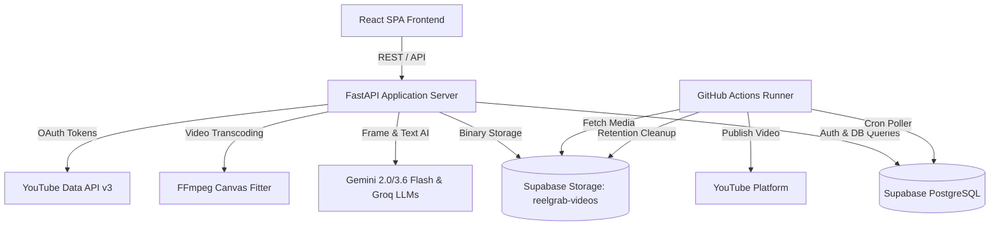

# ReelMob Production Hardening & Architecture Audit

**Date:** September 2026  
**Repository:** [https://github.com/Bhuma005/ReelMob](https://github.com/Bhuma005/ReelMob)  
**Status:** Audit Completed — Pre-Implementation Baseline  

---

## 1. System Architecture Overview

ReelMob is an automated AI-assisted short-form video optimization, scheduling, and publishing engine. It downloads video content (Instagram Reels, YouTube Shorts, etc.), analyzes audio/visual signals, synthesizes high-converting titles, descriptions, and hashtags using Cloud AI, fits content into a 9:16 portrait canvas without cropping, and publishes/schedules to YouTube via cloud background workers.

### Component Breakdown
1. **Frontend (`frontend-react/`)**: React 18 SPA built with Vite, Tailwind CSS, Lucide icons, Zustand state stores, and Vitest test suite.
2. **Backend (`backend/`)**: FastAPI application serving both REST API endpoints and the compiled React SPA. Encapsulates yt-dlp media extraction, FFmpeg fitting, rate limiting, and AI orchestrators.
3. **Database & Cloud Storage (`cloud/`)**: Supabase PostgreSQL database holding queued uploads, permanent library records, audit logs, AI jobs, and OAuth tokens. Supabase Storage bucket (`reelgrab-videos`) stores raw and processed MP4 files.
4. **Cloud Workers (`.github/workflows/` & `cloud/`)**: GitHub Actions workflows running `workflow_upload.py` and `workflow_cleanup.py` on scheduled crons to upload scheduled videos to YouTube and clean expired files.
5. **AI Subsystem (`backend/services/cloud_ai.py`, `backend/ai_pipeline.py`)**: Multi-model pipeline delegating vision/frame inspection to Google Gemini and rapid metadata generation to Groq.

---

## 2. Deep-Dive Subsystem Audits

### 2.1 Database & Schema Architecture
- **Current Tables**:
  - `scheduled_videos`: Holds queue of videos waiting for YouTube publication.
  - `video_library`: Primary library metadata table.
  - `video_activity_log`: Audit trail for video lifecycle events.
  - `videos_audit_log`: Soft-delete archive for cleaned videos.
  - `ai_analysis_jobs`: Stores async AI analysis job status and results.
  - `oauth_tokens`: Stores YouTube OAuth refresh and access tokens.
  - `historical_shorts_data`, `analytics_snapshots`, `posting_slot_scores`: Analytics and scheduling tables.
- **Issues Found**:
  - **P0**: Physical storage deletion in `backend/main.py` deletes `video_library` rows instead of preserving permanent metadata.
  - **P0**: Queue claiming in `workflow_upload.py` lacks atomic concurrency control (`FOR UPDATE SKIP LOCKED`).
  - **P1**: No dedicated `jobs` table for highlights and moderation jobs (which currently live only in volatile Python memory).

### 2.2 AI & Scheduling Architecture
- **Issues Found**:
  - **P0**: AI and fallback systems have hardcoded `"07:30 PM"`, `"7:30 PM"`, and `"Peak evening engagement"` scattered across 8 files (`backend/main.py`, `backend/automate.py`, `backend/services/analysis_service.py`, `backend/agents/master_agent.py`, `backend/agents/posting_agent.py`, `backend/scripts/run_analysis_job.py`, `frontend-react/src/pages/CreateReelPage.jsx`, `frontend-react/src/pages/SchedulerPage.jsx`).
  - **P0**: `backend/posting_engine.py` injects `random.uniform(20.0, 30.0)` and `random.uniform(0.0, 10.0)` into scheduling scores.
  - **P0**: `backend/services/analytics_trends.py` generates fake synthetic views/likes/comments via `random.seed(42)` and `random.randint(-1500, 2200)` when database data is sparse.
  - **P1**: AI was previously asked to generate recommended posting times, conflating LLM creativity with authoritative scheduling.

### 2.3 Job Subsystem Architecture
- **Issues Found**:
  - **P0**: `AI_JOBS_STORE`, `HIGHLIGHT_JOBS`, and `MODERATION_JOBS` are in-memory Python dictionaries (`Dict[str, dict] = {}`). Any worker restart or deployment instantly wipes running and completed jobs.
  - **P1**: Highlights and content moderation execute inside FastAPI `BackgroundTasks` rather than a durable, restart-safe job table.

### 2.4 Upload & Cleanup Reliability
- **Issues Found**:
  - **P0**: `cloud/workflow_upload.py` selects pending records with `sb.table("scheduled_videos").select("*").eq("upload_status", "pending")` and then loops over them updating to `uploading`. Two concurrent runners will select the identical batch and upload duplicate videos to YouTube.
  - **P0**: Lack of worker lease expiry. If a runner crashes mid-upload, the record remains stuck in `uploading` indefinitely.
  - **P1**: Cleanup operations do not gracefully handle non-existent storage files or record retry counters on failure.

### 2.5 Security Architecture
- **Issues Found**:
  - **P0**: Open OAuth Redirect Vulnerability in `backend/youtube_auth.py` (`_get_redirect_uri` blindly trusts `override_uri` starting with `http` or `https`).
  - **P1**: In-memory rate limiting (`RATE_LIMIT_STORE`) does not coordinate across multi-worker deployments.
  - **P1**: In `backend/main.py`, `delete_dashboard_video` wrote to a root file `reelgrab_audit.log`.

### 2.6 Search & Query Performance
- **Issues Found**:
  - **P1**: `/api/dashboard/search` queries up to 100 rows into memory and performs Python substring matching against `LOCAL_VIDEO_TAGS` rather than PostgreSQL full-text search or ILIKE queries with indexes.
  - **P1**: Library endpoints lack cursor or offset pagination, returning full tables.

### 2.7 Code Organization & Technical Debt
- **Issues Found**:
  - **P1**: `backend/main.py` is over 2,150 lines, violating single responsibility principle.
  - **P2**: Unreferenced legacy file `db.json` sits in repository root.
  - **P2**: Legacy unused `frontend/` directory with old vanilla JS implementation.
  - **P2**: Lingering references to `reelgrab` and `ollama` across code comments and scripts.

---

## 3. Discovered Issues Classification Matrix

| Issue ID | Severity | Component | Description | Recommended Resolution |
| :--- | :--- | :--- | :--- | :--- |
| **SEC-01** | **P0** | `backend/youtube_auth.py` | Arbitrary `override_uri` accepted in OAuth login/status | Enforce `ALLOWED_OAUTH_REDIRECT_URIS` allowlist |
| **DAT-01** | **P0** | `cloud/workflow_upload.py` | Non-atomic query-then-update allows duplicate YouTube uploads | Implement atomic claim with worker leasing (`claimed_at`, `lease_expires_at`, `worker_id`) |
| **DAT-02** | **P0** | `backend/main.py` | Manual video deletion deletes `video_library` permanent record | Retain Library record; update status to `cleaned` and nullify `storage_path` |
| **JOB-01** | **P0** | `backend/main.py` | `AI_JOBS_STORE`, `HIGHLIGHT_JOBS`, `MODERATION_JOBS` are in-memory dicts | Migrate all background jobs to durable Supabase `jobs` / `ai_analysis_jobs` tables |
| **SCH-01** | **P0** | `backend/main.py`, `automate.py` | Hardcoded `07:30 PM` fallback presented as intelligent recommendation | Replace with deterministic backend scheduler returning `insufficient_data` when data missing |
| **SCH-02** | **P0** | `backend/posting_engine.py` | `random.uniform()` injects non-deterministic noise into scheduling | Remove randomness; use deterministic slot scoring based on historical views |
| **ANA-01** | **P0** | `backend/services/analytics_trends.py` | `_generate_synthetic_baseline()` fakes views/likes/comments | Remove synthetic baseline; return explicit `insufficient_data` / `ANALYTICS_UNAVAILABLE` state |
| **SEC-02** | **P1** | `backend/main.py` | Rate limiter is in-memory only | Support trusted proxy header extraction and DB/Redis backed rate limiting |
| **SRH-01** | **P1** | `backend/main.py` | Search loads 100 items into memory and merges with in-memory `LOCAL_VIDEO_TAGS` | Delegate search to database-backed ILIKE/text search with indexes and pagination |
| **ARC-01** | **P1** | `backend/main.py` | 2,150-line monolithic controller | Incrementally extract modular APIRouters into `backend/api/` with full backwards compatibility |
| **OPS-01** | **P2** | `Dockerfile` | Uses `npm install` and unpinned pip packages | Enforce `npm ci` and pinned requirements |
| **OPS-02** | **P2** | `.github/workflows/ci.yml` | Uses `npm ci \|\| npm install` masking errors; lacks Docker build check | Remove fallback operator; add Docker build verification step to CI |
| **LEG-01** | **P2** | Root / `db.json` | Unreferenced legacy JSON database in root | Relocate to `tests/fixtures/db.json` or archive |
| **LEG-02** | **P2** | `frontend/` | Legacy prototype frontend unreferenced by production app | Archive / isolate legacy vanilla JS directory |
